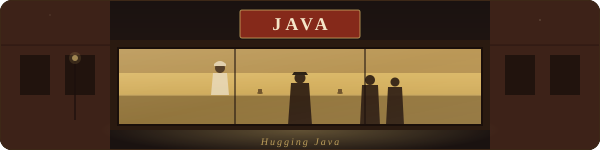

  <picture>
    <source media="(prefers-color-scheme: dark)" srcset="./img/header-dark.svg">
    <source media="(prefers-color-scheme: light)" srcset="./img/header-light.svg">
    
  </picture>

 

Este proyecto reúne apuntes, ejercicios y recursos para repasar Java y aprender nuevas tecnologías del ecosistema. El recorrido abarca desde los fundamentos del lenguaje hasta el desarrollo de aplicaciones web con Spring, Angular, PostgreSQL.

>[!NOTE]
>
> Ha día de hoy siguen pidiendo un stack concreto en las entrevistas y en mi zona es el más solicitado. Por eso la elección del stack.

## Programación

## Persistencia y gestión de datos

## Redes y comunicación

## Calidad de software

## Entorno de desarrollo web

---

<!-- 

 -->